# LibreCompiler

### 文件目录

```
.
├── actions.c
├── build.py
├── compiler.py
├── grammar.c
├── icode_gen.c
├── icode_lex.c
├── input
│   ├── PL0_code0.in
│   ├── PL0_code1.in
│   ├── PL0_code2.in
│   ├── PL0_code3.in
│   └── PL0_code.in
├── lexical.h
├── main.cpp
├── output
│   ├── gtable.txt
│   ├── lex.txt
│   ├── icode.txt
│   └── target.s
├── pl0_global.h
├── preprocess.py
├── README.md
├── save.sh
├── semantic.h
└── tmp/
```

### 构建编译器

```
python build.py
```

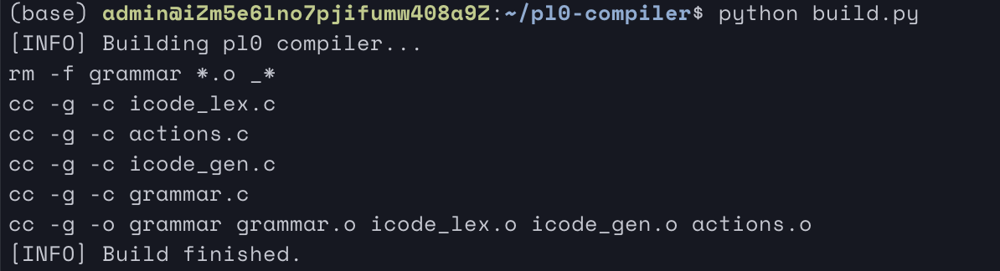

### 编译PL/0源代码并解释执行

```
python compiler.py [源程序路径]
```

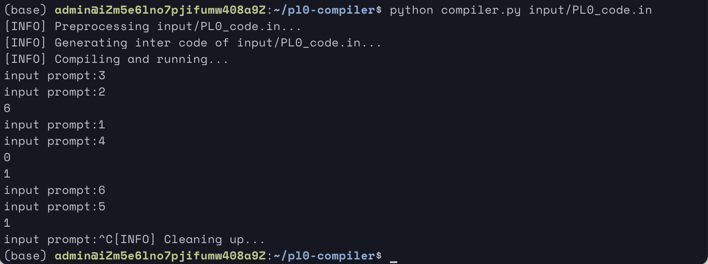

如图，编译PL0_code并立即执行。

### 查看预处理与拼词结果

该处理结果在`output/lex.txt`中，输出实验要求的结果，形如以下格式：

```
SYM	NAME
==========
K_VAR	var
ID	x
D_COMMA	,
ID	y
D_COMMA	,
ID	z
D_COMMA	,
ID	q
D_COMMA	,
ID	r
D_COMMA	,
ID	n
D_COMMA	,
ID	f
D_SEMICOLON	;
K_PROCEDURE	procedure
ID	multiply
D_SEMICOLON	;
```

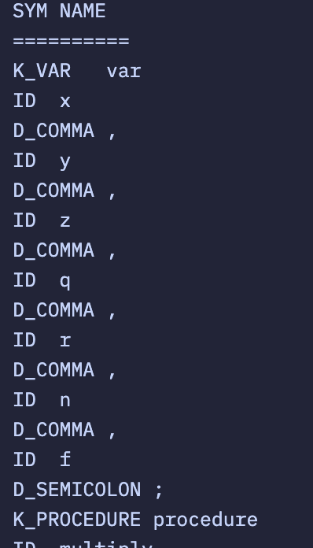

把关键字、算符、界符称为语言固有的单词，标识符、常量称为用户自定义的单词。为此设置两个全程量：NAME,SYM 。

 SYM：存放每个单词的类别。

 NAME：存放单词值。

功能：

- 滤掉单词间的空格。

- 识别关键字，用查关键字表的方法识别。当单词是关键字时，将对应的类别放在SYM中。如IF的类别为IFSYM，THEN的类别为THENSYM。
- 识别标识符，标识符的类别为IDENT，IDENT放在SYM中，标识符本身的值放在NAME中。
- 拼数，将数的类别NUMBER放在SYM中，数本身的值放在NAME中。
- 拼由两个字符组成的运算符，如：>=、<=等等，识别后将类别存放在SYM中。


### 查看符号表

符号表在`output/gtable.txt`中，输出实验要求中需要的表项，形如以下格式：

```
N.	K.	V.	L.	A.
x	1	0	0	3
y	1	0	0	4
z	1	0	0	5
q	1	0	0	6
r	1	0	0	7
n	1	0	0	8
f	1	0	0	9
multiply	2	2	0	10
a	1	0	1	3
divide	2	13	1	10
```

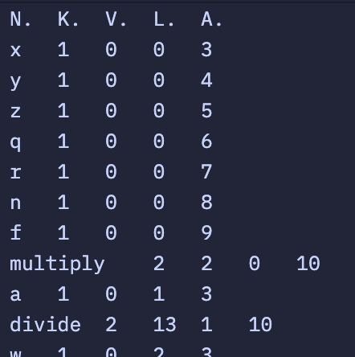


### 查看中间代码(四元式)

中间代码在`output/icode.txt`中，以四元式的方式给出，输出形如以下格式：

```
100 |    :=          x                     a 
101 |    :=          y                     b 
102 |     *          x          y        T_0 
103 |    :=        T_0                     z 
104 |   ret                                  
105 |    :=          x                     r 
106 |    :=          0                   T_1 
107 |    :=        T_1                     q 
108 |    :=          y                     w 
109 |    <=          w          r            
110 |    j0         15                       
111 |    :=          2                   T_2 
112 |     *        T_2          w        T_3 
113 |    :=        T_3                     w 
114 |     j          9                       
115 |     >          w          y            
116 |    j0         31                       
```

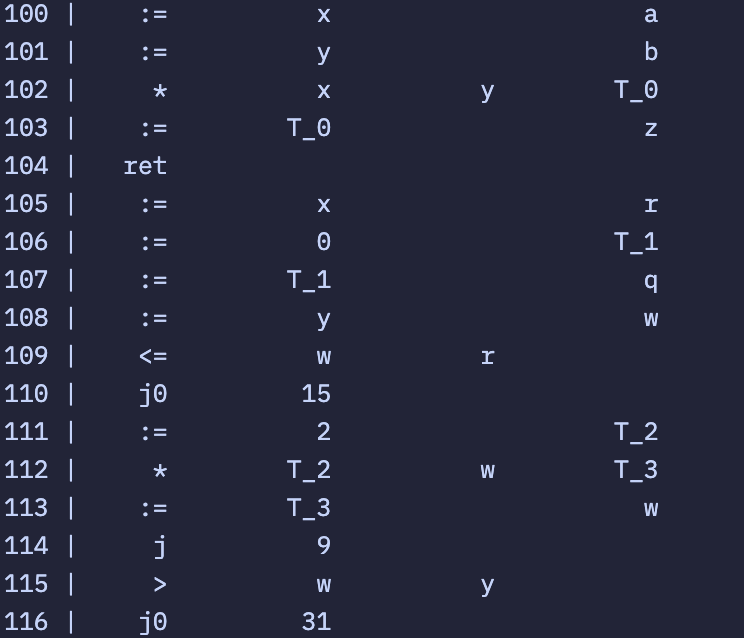

### 查看目标代码

目标代码在`output/target.s`中，以实验要求的假想模型机的指令格式给出，形如以下输出格式：

```
JMP	0	105
JMP	0	2
INT	0	5
LOD	1	3
STO	0	3
LOD	1	4
STO	0	4
LOD	1	3
LOD	1	4
OPR	0	4
STO	1	5
OPR	0	0
JMP	0	13
```

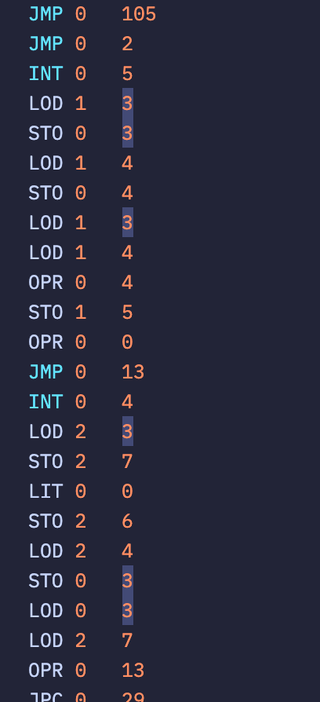

### 用例测试

#### PL0_code.in

编译执行结果

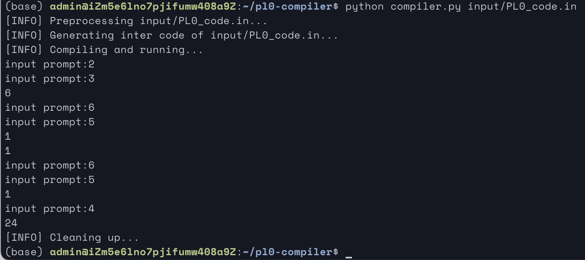

词法分析

```
SYM	NAME
==========
K_VAR	var
ID	x
D_COMMA	,
ID	y
D_COMMA	,
ID	z
D_COMMA	,
ID	q
D_COMMA	,
ID	r
D_COMMA	,
ID	n
D_COMMA	,
ID	f
D_SEMICOLON	;
K_PROCEDURE	procedure
ID	multiply
D_SEMICOLON	;
K_VAR	var
ID	a
D_COMMA	,
ID	b
D_SEMICOLON	;
K_BEGIN	begin
ID	a
O_ASSIGN	:=
ID	x
D_SEMICOLON	;
ID	b
O_ASSIGN	:=
ID	y
D_SEMICOLON	;
ID	z
O_ASSIGN	:=
ID	x
O_MULTI	*
ID	y
K_END	end
D_SEMICOLON	;
K_PROCEDURE	procedure
ID	divide
D_SEMICOLON	;
K_VAR	var
ID	w
D_SEMICOLON	;
K_BEGIN	begin
ID	r
O_ASSIGN	:=
ID	x
D_SEMICOLON	;
ID	q
O_ASSIGN	:=
NUM	0
D_SEMICOLON	;
ID	w
O_ASSIGN	:=
ID	y
D_SEMICOLON	;
K_WHILE	while
ID	w
O_LEQ	<=
ID	r
K_DO	do
ID	w
O_ASSIGN	:=
NUM	2
O_MULTI	*
ID	w
D_SEMICOLON	;
K_WHILE	while
ID	w
O_GTR	>
ID	y
K_DO	do
K_BEGIN	begin
ID	q
O_ASSIGN	:=
NUM	2
O_MULTI	*
ID	q
D_SEMICOLON	;
ID	w
O_ASSIGN	:=
ID	w
O_DIV	/
NUM	2
D_SEMICOLON	;
K_IF	if
ID	w
O_LEQ	<=
ID	r
K_THEN	then
K_BEGIN	begin
ID	r
O_ASSIGN	:=
ID	r
O_MINUS	-
ID	w
D_SEMICOLON	;
ID	q
O_ASSIGN	:=
ID	q
O_PLUS	+
NUM	1
K_END	end
K_END	end
K_END	end
D_SEMICOLON	;
K_PROCEDURE	procedure
ID	gcd
D_SEMICOLON	;
K_VAR	var
ID	g
D_SEMICOLON	;
K_BEGIN	begin
ID	f
O_ASSIGN	:=
ID	x
D_SEMICOLON	;
ID	g
O_ASSIGN	:=
ID	y
D_SEMICOLON	;
K_WHILE	while
ID	f
O_NEQ	#
ID	g
K_DO	do
K_BEGIN	begin
K_IF	if
ID	f
O_LESS	<
ID	g
K_THEN	then
ID	g
O_ASSIGN	:=
ID	g
O_MINUS	-
ID	f
D_SEMICOLON	;
K_IF	if
ID	g
O_LESS	<
ID	f
K_THEN	then
ID	f
O_ASSIGN	:=
ID	f
O_MINUS	-
ID	g
K_END	end
D_SEMICOLON	;
ID	z
O_ASSIGN	:=
ID	f
K_END	end
D_SEMICOLON	;
K_PROCEDURE	procedure
ID	fact
D_SEMICOLON	;
K_BEGIN	begin
K_IF	if
ID	n
O_GTR	>
NUM	1
K_THEN	then
K_BEGIN	begin
ID	f
O_ASSIGN	:=
ID	n
O_MULTI	*
ID	f
D_SEMICOLON	;
ID	n
O_ASSIGN	:=
ID	n
O_MINUS	-
NUM	1
D_SEMICOLON	;
K_CALL	call
ID	fact
K_END	end
K_END	end
D_SEMICOLON	;
K_BEGIN	begin
K_READ	read
D_LP	(
ID	x
D_RP	)
D_SEMICOLON	;
K_READ	read
D_LP	(
ID	y
D_RP	)
D_SEMICOLON	;
K_CALL	call
ID	multiply
D_SEMICOLON	;
K_WRITE	write
D_LP	(
ID	z
D_RP	)
D_SEMICOLON	;
K_READ	read
D_LP	(
ID	x
D_RP	)
D_SEMICOLON	;
K_READ	read
D_LP	(
ID	y
D_RP	)
D_SEMICOLON	;
K_CALL	call
ID	divide
D_SEMICOLON	;
K_WRITE	write
D_LP	(
ID	q
D_RP	)
D_SEMICOLON	;
K_WRITE	write
D_LP	(
ID	r
D_RP	)
D_SEMICOLON	;
K_READ	read
D_LP	(
ID	x
D_RP	)
D_SEMICOLON	;
K_READ	read
D_LP	(
ID	y
D_RP	)
D_SEMICOLON	;
K_CALL	call
ID	gcd
D_SEMICOLON	;
K_WRITE	write
D_LP	(
ID	z
D_RP	)
D_SEMICOLON	;
K_READ	read
D_LP	(
ID	n
D_RP	)
D_SEMICOLON	;
ID	f
O_ASSIGN	:=
NUM	1
D_SEMICOLON	;
K_CALL	call
ID	fact
D_SEMICOLON	;
K_WRITE	write
D_LP	(
ID	f
D_RP	)
K_END	end
D_PERIOD	.
```

符号表

```
N.	K.	V.	L.	A.
x	1	0	0	3
y	1	0	0	4
z	1	0	0	5
q	1	0	0	6
r	1	0	0	7
n	1	0	0	8
f	1	0	0	9
multiply	2	2	0	10
a	1	0	1	3
divide	2	13	1	10
w	1	0	2	3
gcd	2	57	2	10
g	1	0	3	3
fact	2	89	3	10
```

四元式

```
100 |    :=          x                     a 
101 |    :=          y                     b 
102 |     *          x          y        T_0 
103 |    :=        T_0                     z 
104 |   ret                                  
105 |    :=          x                     r 
106 |    :=          0                   T_1 
107 |    :=        T_1                     q 
108 |    :=          y                     w 
109 |    <=          w          r            
110 |    j0         15                       
111 |    :=          2                   T_2 
112 |     *        T_2          w        T_3 
113 |    :=        T_3                     w 
114 |     j          9                       
115 |     >          w          y            
116 |    j0         31                       
117 |    :=          2                   T_4 
118 |     *        T_4          q        T_5 
119 |    :=        T_5                     q 
120 |    :=          2                   T_6 
121 |     /          w        T_6        T_7 
122 |    :=        T_7                     w 
123 |    <=          w          r            
124 |    j0         30                       
125 |     -          r          w        T_8 
126 |    :=        T_8                     r 
127 |    :=          1                   T_9 
128 |     +          q        T_9       T_10 
129 |    :=       T_10                     q 
130 |     j         15                       
131 |   ret                                  
132 |    :=          x                     f 
133 |    :=          y                     g 
134 |     #          f          g            
135 |    j0         45                       
136 |     <          f          g            
137 |    j0         40                       
138 |     -          g          f       T_11 
139 |    :=       T_11                     g 
140 |     <          g          f            
141 |    j0         44                       
142 |     -          f          g       T_12 
143 |    :=       T_12                     f 
144 |     j         34                       
145 |    :=          f                     z 
146 |   ret                                  
147 |    :=          1                  T_13 
148 |     >          n       T_13            
149 |    j0         56                       
150 |     *          n          f       T_14 
151 |    :=       T_14                     f 
152 |    :=          1                  T_15 
153 |     -          n       T_15       T_16 
154 |    :=       T_16                     n 
155 |  call       fact                       
156 |   ret                                  
157 |  read                                x 
158 |  read                                y 
159 |  call   multiply                       
160 | write          z                       
161 |  read                                x 
162 |  read                                y 
163 |  call     divide                       
164 | write          q                       
165 | write          r                       
166 |  read                                x 
167 |  read                                y 
168 |  call        gcd                       
169 | write          z                       
170 |  read                                n 
171 |    :=          1                  T_17 
172 |    :=       T_17                     f 
173 |  call       fact                       
174 | write          f                       
175 |   ret                                  
```

目标代码

```
JMP	0	105
JMP	0	2
INT	0	5
LOD	1	3
STO	0	3
LOD	1	4
STO	0	4
LOD	1	3
LOD	1	4
OPR	0	4
STO	1	5
OPR	0	0
JMP	0	13
INT	0	4
LOD	2	3
STO	2	7
LIT	0	0
STO	2	6
LOD	2	4
STO	0	3
LOD	0	3
LOD	2	7
OPR	0	13
JPC	0	29
LIT	0	2
LOD	0	3
OPR	0	4
STO	0	3
JMP	0	20
LOD	0	3
LOD	2	4
OPR	0	12
JPC	0	55
LIT	0	2
LOD	2	6
OPR	0	4
STO	2	6
LOD	0	3
LIT	0	2
OPR	0	5
STO	0	3
LOD	0	3
LOD	2	7
OPR	0	13
JPC	0	54
LOD	2	7
LOD	0	3
OPR	0	3
STO	2	7
LOD	2	6
LIT	0	1
OPR	0	2
STO	2	6
JMP	0	54
JMP	0	29
OPR	0	0
JMP	0	57
INT	0	4
LOD	3	3
STO	3	9
LOD	3	4
STO	0	3
LOD	3	9
LOD	0	3
OPR	0	9
JPC	0	85
LOD	3	9
LOD	0	3
OPR	0	10
JPC	0	75
LOD	0	3
LOD	3	9
OPR	0	3
STO	0	3
JMP	0	75
LOD	0	3
LOD	3	9
OPR	0	10
JPC	0	84
LOD	3	9
LOD	0	3
OPR	0	3
STO	3	9
JMP	0	84
JMP	0	62
LOD	3	9
STO	3	5
OPR	0	0
JMP	0	89
INT	0	3
LOD	4	8
LIT	0	1
OPR	0	12
JPC	0	104
LOD	4	8
LOD	4	9
OPR	0	4
STO	4	9
LOD	4	8
LIT	0	1
OPR	0	3
STO	4	8
CAL	1	89
JMP	0	104
OPR	0	0
INT	0	10
RED	3	3
RED	3	4
CAL	3	2
LOD	3	5
WRT	0	0
OPR	0	15
RED	3	3
RED	3	4
CAL	2	13
LOD	3	6
WRT	0	0
OPR	0	15
LOD	3	7
WRT	0	0
OPR	0	15
RED	3	3
RED	3	4
CAL	1	57
LOD	3	5
WRT	0	0
OPR	0	15
RED	3	8
LIT	0	1
STO	3	9
CAL	0	89
LOD	3	9
WRT	0	0
OPR	0	15
OPR	0	0
```

#### PL0_code0.in

编译执行结果

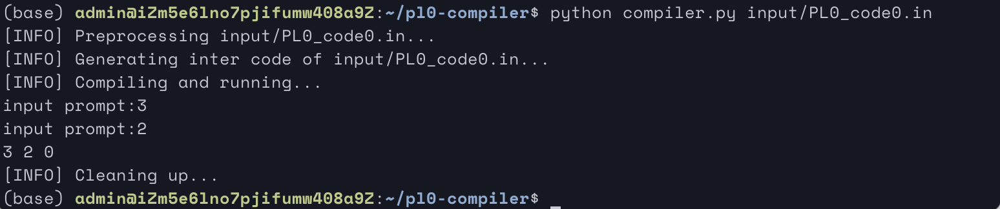

词法分析

```
SYM	NAME
==========
K_CONST	const
ID	a
O_EQ	=
NUM	10
D_SEMICOLON	;
K_VAR	var
ID	d
D_COMMA	,
ID	e
D_COMMA	,
ID	f
D_SEMICOLON	;
K_PROCEDURE	procedure
ID	p
D_SEMICOLON	;
K_VAR	var
ID	g
D_SEMICOLON	;
K_BEGIN	begin
ID	d
O_ASSIGN	:=
ID	a
O_MULTI	*
NUM	2
D_SEMICOLON	;
ID	e
O_ASSIGN	:=
ID	a
O_DIV	/
NUM	3
D_SEMICOLON	;
K_IF	if
ID	d
O_LEQ	<=
ID	e
K_THEN	then
ID	f
O_ASSIGN	:=
ID	d
O_PLUS	+
ID	e
K_END	end
D_SEMICOLON	;
K_BEGIN	begin
K_READ	read
D_LP	(
ID	e
D_COMMA	,
ID	f
D_RP	)
D_SEMICOLON	;
K_WRITE	write
D_LP	(
ID	e
D_COMMA	,
ID	f
D_COMMA	,
ID	d
D_RP	)
D_SEMICOLON	;
K_CALL	call
ID	p
D_SEMICOLON	;
K_WHILE	while
K_ODD	odd
ID	d
K_DO	do
ID	e
O_ASSIGN	:=
O_MINUS	-
ID	e
O_PLUS	+
NUM	1
K_END	end
D_PERIOD	.
```

符号表

```
N.	K.	V.	L.	A.
a	0	10	0	0
d	1	0	0	3
e	1	0	0	4
f	1	0	0	5
p	2	2	0	6
g	1	0	1	3
```

四元式

```
100 |    :=          2                   T_0 
101 |     *          a        T_0        T_1 
102 |    :=        T_1                     d 
103 |    :=          3                   T_2 
104 |     /          a        T_2        T_3 
105 |    :=        T_3                     e 
106 |    <=          d          e            
107 |    j0         10                       
108 |     +          d          e        T_4 
109 |    :=        T_4                     f 
110 |   ret                                  
111 |  read                                e 
112 |  read                                f 
113 | write          e                       
114 | write          f                       
115 | write          d                       
116 |  call          p                       
117 |   odd          d                   T_5 
118 |    j0         24                       
119 |     @          e                   T_6 
120 |    :=          1                   T_7 
121 |     +        T_6        T_7        T_8 
122 |    :=        T_8                     e 
123 |     j         17                       
124 |   ret                                  
```

目标代码

```
JMP	0	21
JMP	0	2
INT	0	4
LIT	0	10
LIT	0	2
OPR	0	4
STO	1	3
LIT	0	10
LIT	0	3
OPR	0	5
STO	1	4
LOD	1	3
LOD	1	4
OPR	0	13
JPC	0	20
LOD	1	3
LOD	1	4
OPR	0	2
STO	1	5
JMP	0	20
OPR	0	0
INT	0	6
RED	0	4
RED	0	5
LOD	0	4
WRT	0	0
LOD	0	5
WRT	0	0
LOD	0	3
WRT	0	0
OPR	0	15
CAL	0	2
LOD	0	3
OPR	0	6
JPC	0	41
LOD	0	4
OPR	0	1
LIT	0	1
OPR	0	2
STO	0	4
JMP	0	32
OPR	0	0
```

#### PL0_code1.in

编译执行结果

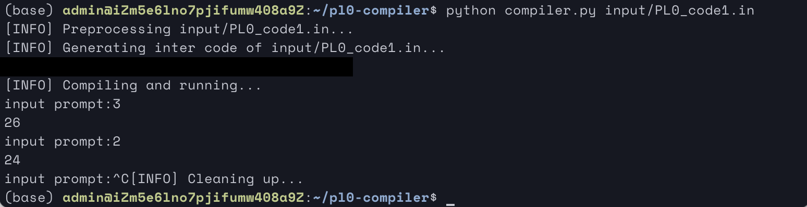

词法分析

```
SYM	NAME
==========
K_CONST	const
ID	a
O_EQ	=
NUM	10
D_SEMICOLON	;
K_VAR	var
ID	b
D_COMMA	,
ID	c
D_SEMICOLON	;
K_PROCEDURE	procedure
ID	p
D_SEMICOLON	;
K_BEGIN	begin
ID	c
O_ASSIGN	:=
ID	b
O_PLUS	+
ID	a
K_END	end
D_SEMICOLON	;
K_BEGIN	begin
K_READ	read
D_LP	(
ID	b
D_RP	)
D_SEMICOLON	;
K_WHILE	while
ID	b
O_NEQ	#
NUM	0
K_DO	do
K_BEGIN	begin
K_CALL	call
ID	p
D_SEMICOLON	;
K_WRITE	write
D_LP	(
NUM	2
O_MULTI	*
ID	c
D_RP	)
D_SEMICOLON	;
K_READ	read
D_LP	(
ID	b
D_RP	)
D_SEMICOLON	;
K_END	end
K_END	end
D_PERIOD	.
```

符号表

```
N.	K.	V.	L.	A.
a	0	10	0	0
b	1	0	0	3
c	1	0	0	4
p	2	2	0	5
```

四元式

```
JMP	0	21
JMP	0	2
INT	0	4
LIT	0	10
LIT	0	2
OPR	0	4
STO	1	3
LIT	0	10
LIT	0	3
OPR	0	5
STO	1	4
LOD	1	3
LOD	1	4
OPR	0	13
JPC	0	20
LOD	1	3
LOD	1	4
OPR	0	2
STO	1	5
JMP	0	20
OPR	0	0
INT	0	6
RED	0	4
RED	0	5
LOD	0	4
WRT	0	0
LOD	0	5
WRT	0	0
LOD	0	3
WRT	0	0
OPR	0	15
CAL	0	2
LOD	0	3
OPR	0	6
JPC	0	41
LOD	0	4
OPR	0	1
LIT	0	1
OPR	0	2
STO	0	4
JMP	0	32
OPR	0	0
```

目标代码

```
JMP	0	8
JMP	0	2
INT	0	3
LOD	1	3
LIT	0	10
OPR	0	2
STO	1	4
OPR	0	0
INT	0	5
RED	0	3
LOD	0	3
LIT	0	0
OPR	0	9
JPC	0	22
CAL	0	2
LIT	0	2
LOD	0	4
OPR	0	4
WRT	0	0
OPR	0	15
RED	0	3
JMP	0	10
OPR	0	0
```

#### PL0_code2.in

编译执行结果

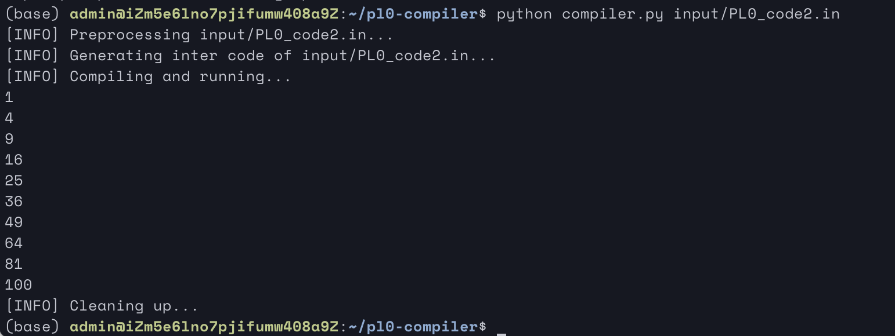

词法分析

```
SYM	NAME
==========
K_VAR	var
ID	x
D_COMMA	,
ID	squ
D_SEMICOLON	;
K_PROCEDURE	procedure
ID	square
D_SEMICOLON	;
K_BEGIN	begin
ID	squ
O_ASSIGN	:=
ID	x
O_MULTI	*
ID	x
K_END	end
D_SEMICOLON	;
K_BEGIN	begin
ID	x
O_ASSIGN	:=
NUM	1
D_SEMICOLON	;
K_WHILE	while
ID	x
O_LEQ	<=
NUM	10
K_DO	do
K_BEGIN	begin
K_CALL	call
ID	square
D_SEMICOLON	;
K_WRITE	write
D_LP	(
ID	squ
D_RP	)
D_SEMICOLON	;
ID	x
O_ASSIGN	:=
ID	x
O_PLUS	+
NUM	1
K_END	end
K_END	end
D_PERIOD	.
```

符号表

```
N.	K.	V.	L.	A.
x	1	0	0	3
squ	1	0	0	4
square	2	2	0	5
```

四元式

```
100 |     *          x          x        T_0 
101 |    :=        T_0                   squ 
102 |   ret                                  
103 |    :=          1                   T_1 
104 |    :=        T_1                     x 
105 |    :=         10                   T_2 
106 |    <=          x        T_2            
107 |    j0         14                       
108 |  call     square                       
109 | write        squ                       
110 |    :=          1                   T_3 
111 |     +          x        T_3        T_4 
112 |    :=        T_4                     x 
113 |     j          5                       
114 |   ret                                  
```

目标代码

```
JMP	0	8
JMP	0	2
INT	0	3
LOD	1	3
LOD	1	3
OPR	0	4
STO	1	4
OPR	0	0
INT	0	5
LIT	0	1
STO	0	3
LOD	0	3
LIT	0	10
OPR	0	13
JPC	0	24
CAL	0	2
LOD	0	4
WRT	0	0
OPR	0	15
LOD	0	3
LIT	0	1
OPR	0	2
STO	0	3
JMP	0	11
OPR	0	0
```

#### PL0_code3.in

编译执行结果

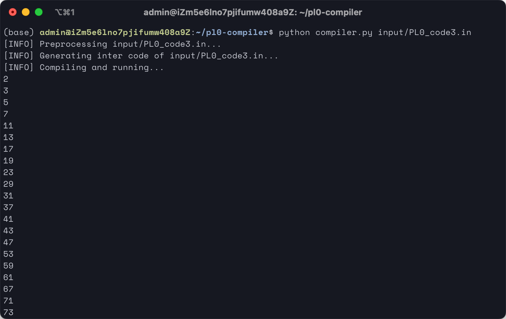

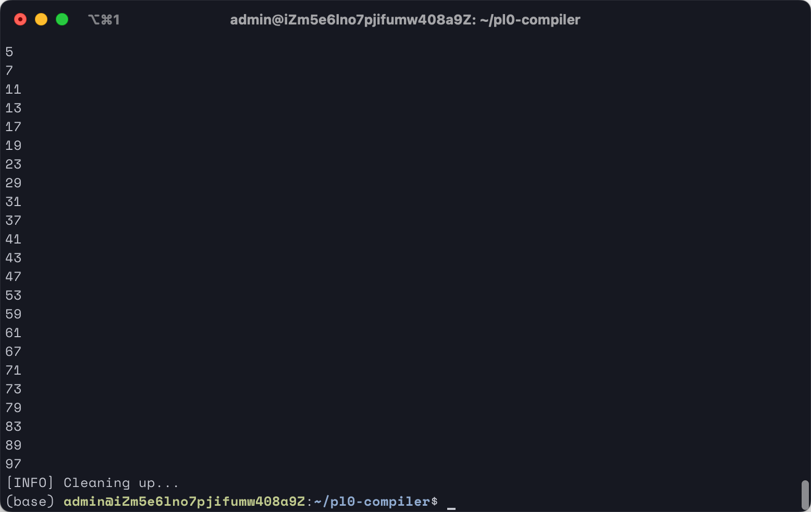

词法分析

```
SYM	NAME
==========
K_CONST	const
ID	max
O_EQ	=
NUM	100
D_SEMICOLON	;
K_VAR	var
ID	arg
D_COMMA	,
ID	ret
D_SEMICOLON	;
K_PROCEDURE	procedure
ID	isprime
D_SEMICOLON	;
K_VAR	var
ID	i
D_SEMICOLON	;
K_BEGIN	begin
ID	ret
O_ASSIGN	:=
NUM	1
D_SEMICOLON	;
ID	i
O_ASSIGN	:=
NUM	2
D_SEMICOLON	;
K_WHILE	while
ID	i
O_LESS	<
ID	arg
K_DO	do
K_BEGIN	begin
K_IF	if
ID	arg
O_DIV	/
ID	i
O_MULTI	*
ID	i
O_EQ	=
ID	arg
K_THEN	then
K_BEGIN	begin
ID	ret
O_ASSIGN	:=
NUM	0
D_SEMICOLON	;
ID	i
O_ASSIGN	:=
ID	arg
K_END	end
D_SEMICOLON	;
ID	i
O_ASSIGN	:=
ID	i
O_PLUS	+
NUM	1
K_END	end
K_END	end
D_SEMICOLON	;
K_PROCEDURE	procedure
ID	primes
D_SEMICOLON	;
K_BEGIN	begin
ID	arg
O_ASSIGN	:=
NUM	2
D_SEMICOLON	;
K_WHILE	while
ID	arg
O_LESS	<
ID	max
K_DO	do
K_BEGIN	begin
K_CALL	call
ID	isprime
D_SEMICOLON	;
K_IF	if
ID	ret
O_EQ	=
NUM	1
K_THEN	then
K_WRITE	write
D_LP	(
ID	arg
D_RP	)
D_SEMICOLON	;
ID	arg
O_ASSIGN	:=
ID	arg
O_PLUS	+
NUM	1
K_END	end
K_END	end
D_SEMICOLON	;
K_CALL	call
ID	primes
D_PERIOD	.
```

符号表

```
N.	K.	V.	L.	A.
max	0	100	0	0
arg	1	0	0	3
ret	1	0	0	4
isprime	2	2	0	5
i	1	0	1	3
primes	2	31	1	5
```

四元式

```
100 |    :=          1                   T_0 
101 |    :=        T_0                   ret 
102 |    :=          2                   T_1 
103 |    :=        T_1                     i 
104 |     <          i        arg            
105 |    j0         17                       
106 |     /        arg          i        T_2 
107 |     *        T_2          i        T_3 
108 |     =        T_3        arg            
109 |    j0         13                       
110 |    :=          0                   T_4 
111 |    :=        T_4                   ret 
112 |    :=        arg                     i 
113 |    :=          1                   T_5 
114 |     +          i        T_5        T_6 
115 |    :=        T_6                     i 
116 |     j          4                       
117 |   ret                                  
118 |    :=          2                   T_7 
119 |    :=        T_7                   arg 
120 |     <        arg        max            
121 |    j0         31                       
122 |  call    isprime                       
123 |    :=          1                   T_8 
124 |     =        ret        T_8            
125 |    j0         27                       
126 | write        arg                       
127 |    :=          1                   T_9 
128 |     +        arg        T_9       T_10 
129 |    :=       T_10                   arg 
130 |     j         20                       
131 |   ret                                  
132 |  call     primes                       
133 |   ret                                  
```

目标代码

```
JMP	0	53
JMP	0	2
INT	0	4
LIT	0	1
STO	1	4
LIT	0	2
STO	0	3
LOD	0	3
LOD	1	3
OPR	0	10
JPC	0	29
LOD	1	3
LOD	0	3
OPR	0	5
LOD	0	3
OPR	0	4
LOD	1	3
OPR	0	8
JPC	0	24
LIT	0	0
STO	1	4
LOD	1	3
STO	0	3
JMP	0	24
LOD	0	3
LIT	0	1
OPR	0	2
STO	0	3
JMP	0	7
OPR	0	0
JMP	0	31
INT	0	3
LIT	0	2
STO	2	3
LOD	2	3
LIT	0	100
OPR	0	10
JPC	0	52
CAL	2	2
LOD	2	4
LIT	0	1
OPR	0	8
JPC	0	47
LOD	2	3
WRT	0	0
OPR	0	15
JMP	0	47
LOD	2	3
LIT	0	1
OPR	0	2
STO	2	3
JMP	0	34
OPR	0	0
INT	0	5
CAL	0	31
OPR	0	0
```

